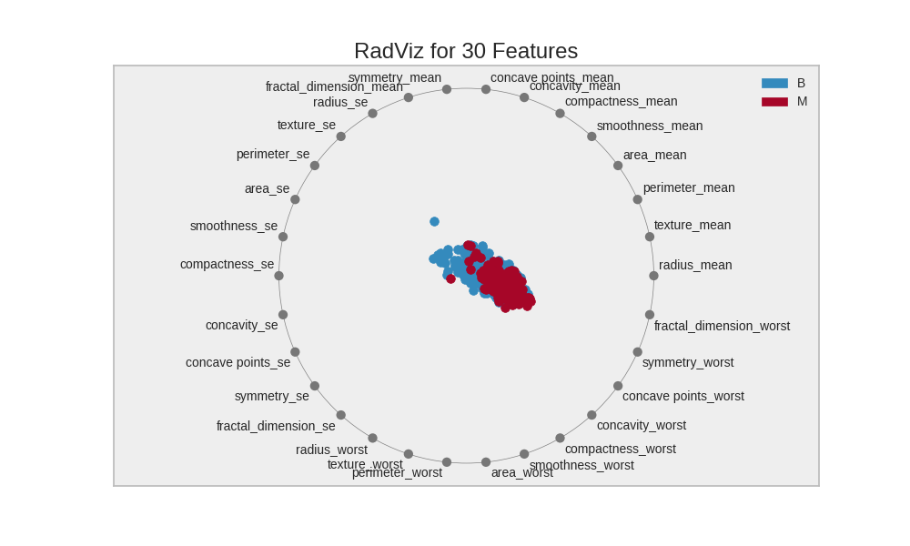
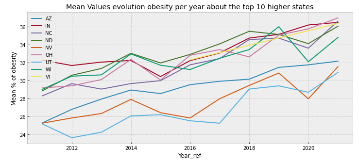
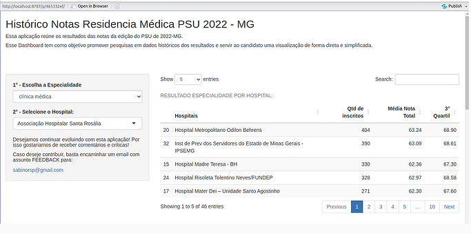
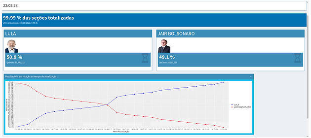

# My projects in Data Science and Machine Learning
---

## This project aims to develop a model for classifying cells as either malignant or benign.

This project went through several stages, including exploratory analysis, data pre-processing, model selection, model evaluation, and final classification model selection. The data used in this project was sourced from Kaggle  ([source](https://www.kaggle.com/datasets/erdemtaha/cancer-data)) and includes geometric characteristics of cancer cells that were classified as either benign or malignant.

  

[View code on Github](https://github.com/sabinorsp/cancer_data_classification/tree/master)

 
     
---

## Exploratory data analysis about Nutrition, Physical Activity, and Obesity. 
This project are a exploratory data analysis about a dataset that includes data on adult's diet, physical activity, and weight status from Behavioral Risk Factor Surveillance System - EUA. This data is used for DNPAO's Data, Trends, and Maps database, which provides national and state specific data on obesity, nutrition, physical activity.

  

      

[View code on Github](https://github.com/sabinorsp/eda_datagoveua_nutrition)

## Dashboard results about of the PSU-MG selection process -2022. 

The project aimed to create a web application with a dashboard model (using Python, the statistical software R, and the Shiny framework) for loading and providing data related to the scores of the medical residency selection process of PSU in the year 2022 in the state of Minas Gerais.

  

   

[View code on Github](https://github.com/sabinorsp/dashboard_psu_mg)

---

## Dashboard to Monitoring Presidential Election 2nd Round 2022 Brazil.

This project aims to create a web application for monitoring the vote counting of the 2nd round of the Brazilian presidential election of 2022. The vote counting data will be transmitted via API by the Brazilian Superior Electoral. They will be captured and processed using the statistical software R. Finally, the web application will be built using the Shiny package of R.

  

 

[View code on Github](https://github.com/sabinorsp/dashboard_eleicoes_2022_r)

---

